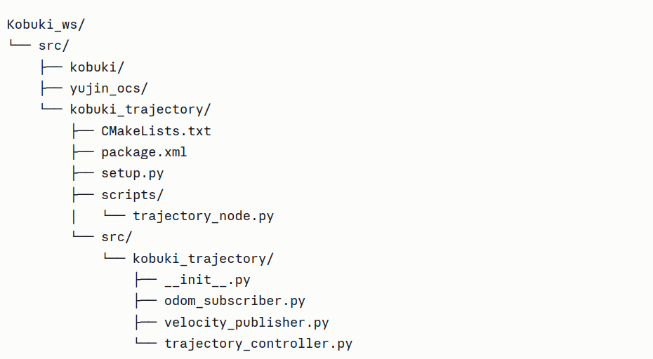
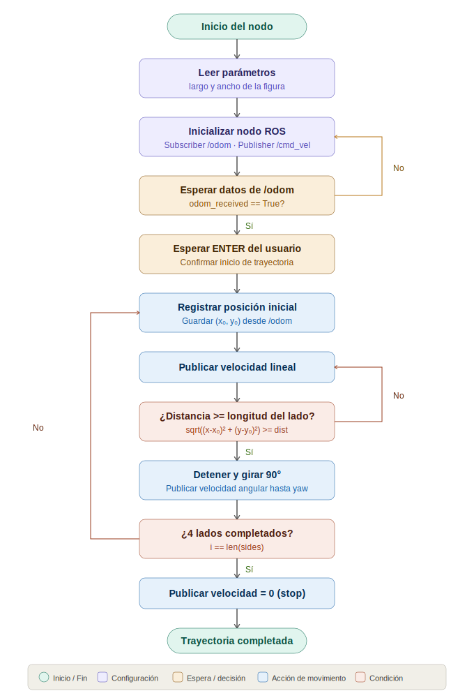

# Laboratorio No. 03 - Fundamentos de Robótica Móvil
### El poder de ROS

**Universidad Nacional de Colombia**  
Facultad de Ingeniería  
Departamento de Ingeniería Mecánica y Mecatrónica  
Curso: Robótica Móvil 2026-I

---

## Integrantes
- Duvan Stiven Tique Osorio
- Juan Carlos Gonzalez Ibarra
- Àngel Rivera Amòrtegui
- Jesùs Manuel Aragòn Buitrago

---

## 1. Descripción de la solución implementada

### Actividad 1 — Verificación del funcionamiento del robot Kobuki

Para esta actividad se configuró el workspace de ROS Noetic clonando
los repositorios oficiales del robot Kobuki y sus dependencias. Una vez
lanzado el nodo principal con `minimal.launch`, se realizó una exploración
completa del grafo de computación de ROS.

#### Tópicos explorados

| Tópico | Tipo de mensaje | Descripción |
|--------|----------------|-------------|
| `/mobile_base/commands/velocity` | `geometry_msgs/Twist` | Control de velocidad lineal y angular |
| `/odom` | `nav_msgs/Odometry` | Estimación de posición y orientación |
| `/mobile_base/events/cliff` | `kobuki_msgs/CliffEvent` | Detección de desniveles o bordes |
| `/mobile_base/events/bumper` | `kobuki_msgs/BumperEvent` | Detección de colisiones físicas |
| `/mobile_base/events/wheel_drop` | `kobuki_msgs/WheelDropEvent` | Detección de rueda en el aire |
| `/mobile_base/sensors/imu_data` | `sensor_msgs/Imu` | Datos del giroscopio de 3 ejes |
| `/mobile_base/commands/led1` | `kobuki_msgs/Led` | Control del LED 1 |
| `/mobile_base/commands/led2` | `kobuki_msgs/Led` | Control del LED 2 |
| `/mobile_base/commands/sound` | `kobuki_msgs/Sound` | Control del sonido |

#### Movimiento manual publicando en el tópico de velocidad

Se identificó que el tópico `/mobile_base/commands/velocity` recibe
mensajes de tipo `geometry_msgs/Twist`, donde `linear.x` controla el
avance y `angular.z` controla la rotación. Se publicaron comandos
directamente desde terminal:

```bash
rostopic pub /mobile_base/commands/velocity geometry_msgs/Twist "linear:
  x: 0.1
  y: 0.0
  z: 0.0
angular:
  x: 0.0
  y: 0.0
  z: 0.0"
```

#### Monitoreo de odometría

Se monitoreó el tópico `/odom` en paralelo al movimiento del robot.
Se observó que al desplazarse en línea recta, la posición estimada
presenta pequeñas variaciones en los ejes perpendiculares al movimiento,
evidenciando el error acumulativo propio de la odometría.

#### Teleoperación y sensores cliff

Se utilizó `safe_keyop.launch` para controlar manualmente el robot.
Durante la prueba se monitoreó `/mobile_base/events/cliff`, observando
que al acercar el robot a un borde, los sensores infrarrojos inferiores
publican un evento de tipo `CliffEvent` indicando el sensor activado
(izquierdo, central o derecho) y el robot detiene su movimiento
automáticamente como medida de seguridad.

---

### Actividad 2 — Creación de un nodo propio

Se desarrolló un paquete ROS llamado `kobuki_trajectory` que permite
al robot Kobuki recorrer una figura geométrica rectangular de dimensiones
configurables. El paquete sigue la estructura estándar de ROS separando
las responsabilidades en módulos independientes.

#### Estructura del paquete



#### Lógica de control implementada

El nodo suscribe al tópico `/odom` para leer la posición y orientación
del robot en tiempo real. La trayectoria rectangular se divide en 4 lados
alternando lados de `largo` y `ancho`. Para cada lado:

1. Se registra la posición inicial `(x₀, y₀)`.
2. Se publica velocidad lineal constante hasta que la distancia
   euclidiana recorrida alcanza la longitud del lado.
3. Se detiene el robot y se ejecuta un giro de 90° controlado por
   la variación del ángulo `yaw` leído desde la odometría.

El programa espera la interacción del usuario mediante la tecla `ENTER`
antes de iniciar la ejecución, y recibe las dimensiones de la figura
como parámetros de ROS.

---

## 2. Diagrama de flujo



---

## 3. Respuestas a las preguntas de análisis

**¿Qué sensores utiliza el robot Kobuki para estimar su odometría?**

El Kobuki utiliza encoders de cuadratura integrados en cada rueda de
tracción. Estos encoders miden la rotación de cada rueda con alta
resolución, permitiendo estimar el desplazamiento lineal y angular
mediante el modelo cinemático de tracción diferencial. Adicionalmente,
cuenta con un giroscopio digital de tres ejes que complementa la
estimación de orientación.

**¿Por qué la odometría puede presentar errores incluso cuando el
robot se mueve en línea recta?**

La odometría es una técnica de estimación relativa que acumula error
con el tiempo. Las principales causas de error son: deslizamiento de
las ruedas sobre la superficie, diferencias mínimas en el diámetro
real de cada rueda respecto al valor nominal, irregularidades del
terreno, resolución finita de los encoders, y la naturaleza acumulativa
del cálculo (cada pequeño error se suma al anterior). Por ello, aunque
el robot reciba comandos perfectamente simétricos, la posición estimada
diverge gradualmente de la real.

**¿Cuál es la función de los sensores cliff y por qué son importantes
en robots móviles?**

Los sensores cliff son sensores infrarrojos ubicados en la parte
inferior del chasis del Kobuki, orientados hacia el suelo. Su función
es detectar la ausencia de superficie (bordes, escalones, desniveles
pronunciados) midiendo la distancia al piso. Cuando detectan que el
suelo desaparece, publican un evento en `/mobile_base/events/cliff`
y el sistema de seguridad detiene el robot automáticamente. Son
fundamentales en robots móviles de interior porque protegen al robot
de caídas que podrían dañar su hardware y previenen situaciones
peligrosas en entornos domésticos o de laboratorio.

---

## 4. Instrucciones de uso

### Requisitos
- Ubuntu 20.04
- ROS Noetic
- Robot Kobuki conectado por USB

### Configuración del workspace

```bash
mkdir -p ~/Kobuki_ws/src
cd ~/Kobuki_ws/src

git clone https://github.com/yujinrobot/kobuki
git clone --filter=blob:none --no-checkout https://github.com/yujinrobot/yujin_ocs.git
cd yujin_ocs
git sparse-checkout init --cone
git sparse-checkout set yocs_cmd_vel_mux yocs_controllers yocs_velocity_smoother
git checkout
cd

sudo apt install liborocos-kdl-dev
cd ~/Kobuki_ws
rosdep install --from-paths src --ignore-src -r -y
catkin_make
source devel/setup.bash
```

### Ejecución

```bash
# Terminal 1 — lanzar el robot
roslaunch kobuki_node minimal.launch --screen

# Terminal 2 — ejecutar la trayectoria (ejemplo: 1m x 0.5m)
rosrun kobuki_trajectory trajectory_node.py _largo:=1.0 _ancho:=0.5
```

### Parámetros disponibles

| Parámetro | Descripción | Valor por defecto |
|-----------|-------------|-------------------|
| `_largo`  | Longitud del lado largo del rectángulo (m) | `1.0` |
| `_ancho`  | Longitud del lado corto del rectángulo (m) | `0.5` |

---

## 5. Código fuente

El código fuente completo se encuentra en la carpeta `src/kobuki_trajectory/`
y el nodo ejecutable en `scripts/trajectory_node.py`.

| Archivo | Responsabilidad |
|---------|----------------|
| `trajectory_node.py` | Punto de entrada |
| `odom_subscriber.py` | Suscripción y lectura de `/odom` |
| `velocity_publisher.py` | Publicación de comandos de velocidad |
| `trajectory_controller.py` | Lógica de movimiento y control |

---

## 6. Evidencias


---

## 7. Referencias

- Cárdenas P., Ramírez R., Daleman J. *Uso del robot Kobuki mediante ROS*. 
  Universidad Nacional de Colombia, 2025.
- ROS Wiki. *Writing a Publisher and Subscriber (Python)*.
  http://wiki.ros.org/ROS/Tutorials/WritingPublisherSubscriber(python)
- Kobuki Team. *Kobuki User Guide*, 2017.
  http://kobuki.yujinrobot.com
  
